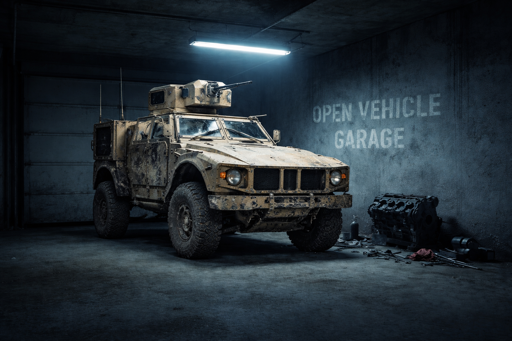

A3OVG
=====

[][discord]

**Arma ]|[ Open Vehicle Garage**

An open source vehicle garage mod for use with Arma 3 mods.

Features
--------

* TBD

Installation
------------

### Sources

A3OVG is available at [my personal gitlab][gitlab-a3ovg].

### Building

#### Prerequisites

In order to get working .pbos out of source codes, you'll need:

* Arma 2.20
* [Arma 3 Tools][arma-tools]
* [Git][git]
* [HEMTT][hemtt] - An opinionated build system for Arma 3 mods
* Sources from [here][gitlab-a3ovg]

#### Creating .pbos

The mod's .pbos are created with HEMTT; a casual `hemtt build` should do the trick.

Usage
-----

A3OVG does nothing by itself. It's made to be used by third party mods as a vehicle storage.

Bugs
----

¯\\_(ツ)_/¯

Authors
---

* UnseenKill/gor3Splatter

[arma-tools]: https://store.steampowered.com/app/233800/Arma_3_Tools/
[discord]: https://discord.gg/TfgYZeRWf4
[git]: https://git-scm.com/downloads
[gitlab]: https://gitlab.perfect-co.de/gor3Splatter
[gitlab-a3ovg]: https://gitlab.perfect-co.de/arma3/a3a-open-vehicle-garage
[hemtt]: https://github.com/BrettMayson/HEMTT
